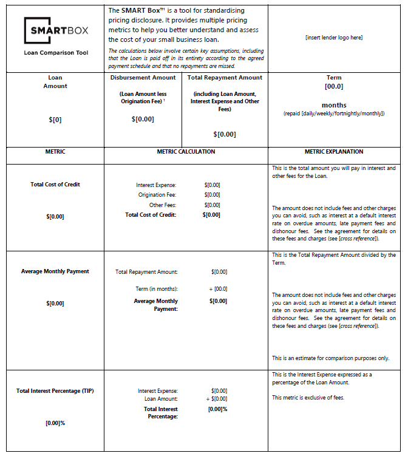
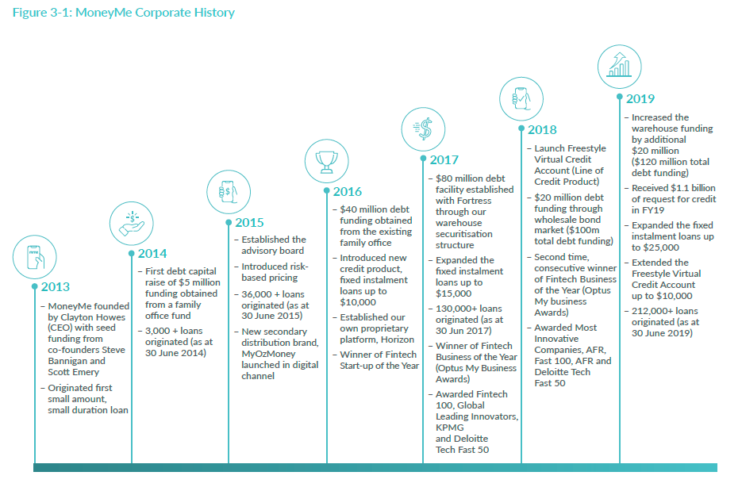
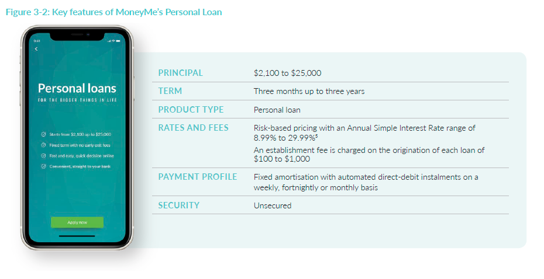
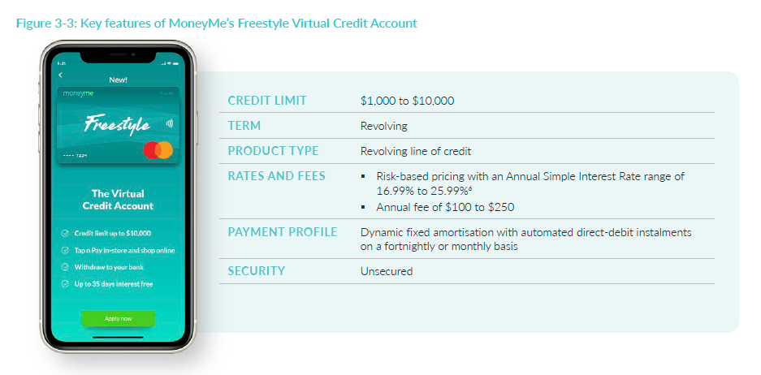

<a name="top"></a>
<p align="center">
  
</p>

## Table of Contents

- [Table of Contents](#table-of-contents)
  - [Overview and Origin](#overview-and-origin)
    - [Introduction](#introduction)
  - [Meet the Founders](#meet-the-founders)
    - [Andrew Watt](#andrew-watt)
    - [Piers Moller](#piers-moller)
    - [Aris Allegos](#aris-allegos)
  - [Funding](#funding)
  - [Business Activities](#business-activities)
    - [What specific financial activities is the company or project trying to solve?](#what-specific-financial-activities-is-the-company-or-project-trying-to-solve)
    - [Who is the companies intended customer? Is there any information about the market size of this set of customers?](#who-is-the-companies-intended-customer-is-there-any-information-about-the-market-size-of-this-set-of-customers)
    - [What solution does this company offer that their competitors do not or cannot offer?](#what-solution-does-this-company-offer-that-their-competitors-do-not-or-cannot-offer)
    - [Which technologies are they currently using, and how are they implementing them?](#which-technologies-are-they-currently-using-and-how-are-they-implementing-them)
      - [Artificial Intelligence and Machine Learning](#artificial-intelligence-and-machine-learning)
      - [Data Security](#data-security)
  - [Landscape](#landscape)
- [Recommendations](#recommendations)
    - [If you were to advise the company, what products or services would you suggest they offer?](#if-you-were-to-advise-the-company-what-products-or-services-would-you-suggest-they-offer)
    - [Why do you think that offering this product or service will benefit the company?](#why-do-you-think-that-offering-this-product-or-service-will-benefit-the-company)
  - [Company Timeline](#company-timeline)
  - [Key Features of MoneyMe's Personal Loan](#key-features-of-moneymes-personal-loan)
  - [Key Features of MoneyMe's Virtual Credit Card](#key-features-of-moneymes-virtual-credit-card)
    - [What technologies would this product or service utilise? Why are these technologies appropriate for your solution?](#what-technologies-would-this-product-or-service-utilise-why-are-these-technologies-appropriate-for-your-solution)


### Overview and Origin 

```
> Name of company

> When was the company incorporated? 
```

#### Introduction ####

Established in 2013, [Moula](https://moula.com.au "Moula") is an Australian FinTech that provides working capital to small and medium business to help grow their business. By integrating accounting data with machine learning and artificial intelligence, Moula can process loan applications and make responsible lending decisions within minutes. Successful loan applications can result in business loans of up to $500,000 being made available in 24-48 hours.

 Moula is one of the six original signatories to Australian Finance Industry Association Code of Lending Practice.

The [AFIA Code](https://afia.asn.au/AFIA-Online-Small-Business-Lenders-Code-of-Lending-Practice "AFIA Code") has been developed with support from the Australian Small Business and Family Enterprise Ombudsman, theBankDoctor.org and FinTech Australia. The Code establishes a new level of industry best practice in the small business finance segment as FinTech lenders play an increasingly important role in the Australian economy by providing access to credit for small and medium businesses. 

<br/>
<div align="right">
    <b><a href="#top">↥ back to top</a></b>
</div>
<br/>

### Meet the Founders ###

```
> Who are the founders?
```

#### Andrew Watt ####

 Andrew spent over 16 years with a number of financial institutions in London – including Deutsche Bank, Standard Chartered, Nomura and Royal Bank of Scotland – spanning risk management, credit modelling and structuring. As COO, he is responsible for managing the lending process from the point of underwriting to execution and settlement, and post-settlement support. Andrew has a Bachelor of Commerce from the University of Melbourne and is a Chartered Accountant of Australia.

<br/>

#### Piers Moller ####

 

Piers is a co-founder and CTO of Moula. He has been working in information technology since 1997 with financial institutions including Royal Bank of Scotland, BNP Paribas , Barclays Capital. 

Piers is credited for the development of Moula’s proprietary platform that simplifies the business lending process. He has a Bachelor of Science in Astronomy from University College London and a Masters in Science from Middlesex University London.

<br/>

#### Aris Allegos ####


Aris co-founded Moula to provide Australian SMEs with a better way to access finance. Growing up around a family business, he experienced first-hand the challenges faced by SMEs.

Aris is a co-fouder with over 15 years’ experience working in banking in London and Hong Kong, including roles with Credit Suisse and Nomura. He holds an MBA from London Business School, and a Bachelor of Commerce and Bachelor of Law from Monash University.

<br/>
<div align="right">
    <b><a href="#top">↥ back to top</a></b>
</div>
<br/>

### Funding ###

```
> How is the company funded? 

> How much funding have they received? 
```

<p align="center">
  
</p>

According to [Crunchbase](https://www.crunchbase.com/organization/moula "Crunchbase"), Moula has raised a total of $50.9M in funding over 3 rounds from the following investors - 
* [Acorn Capital](https://www.acorncapital.com.au/ "Acorn Capital")
* [Liberty Financial](https://www.liberty.com.au/ "Liberty Financial")
* [Escala Partners](https://escalapartners.com.au/ "Escala Partners")
* [NCN Investments](https://www.linkedin.com/company/ncn-investments/about/ "NCN Investments")
* [Liberty Financial Companies, Inc](https://www.liberty.com.au/ "Liberty Financial Companies")

Their latest funding was raised on December 9, 2019 from a Series D round. Acorn Capital and Liberty Financial are the most recent investors. 

Date | Funding Round | Money Raised
| :--- | ---: | :---:
9 December 2019  | Series D | $20M
9 June 2015  | Series A | $30M
1 November 2014 | Seed Round | $1M

[Invest Victoria](https://www.invest.vic.gov.au/opportunities/fintech "Invest Victoria") reports the company raised $160 million Series D in 2020.

<br/>
<div align="right">
    <b><a href="#top">↥ back to top</a></b>
</div>
<br/>

### Business Activities ###

```
> What specific financial activities is the company or project trying to solve? 

> Who is the company's intended customer? Is there any information about the market size of this set of customers? 

> What solution does this company offer that their competitors do not or cannot offer? 
```

#### What specific financial activities is the company or project trying to solve? ####

Moula's Chief Product and Strategy Officer, Justin Green, explains the reason that traditional banks are ineffective for many businessnes -  

> “If you don’t have the benefit of assets, like the family home to put up as collateral, then your ability to borrow money from the bank is pretty limited. So Moula’s thesis was very much ‘can we partner with small businesses?’, try and demystify this volatility that exists in small businesses, encourage this open-sharing of business data, as the critical asset to understand the nature of someone’s business,” says Green.

Moula has recognised the value of the data that small business held about itself. If there was a way for lenders to see that data, analyse it, and assess the opportunities and risk – in short, determine the creditworthiness of the business – then it would be possible to identify who to offer loans to, because the data revealed that the underlying business was not a credit risk.

Moula has partnered with cloud accounting business Xero that many small businesses already trust with their data, and developed it's AI and machine learning algorithm to underpin the loan process.

<br/>
<div align="right">
    <b><a href="#top">↥ back to top</a></b>
</div>
<br/>

#### Who is the companies intended customer? Is there any information about the market size of this set of customers? 

Moula provides business loans to small and medium sized Australian businessnes. 

Australia is home to around 2.3 million businesses. Most of them class as small and medium and are the backbone of the Australian economy, creating around 7 million jobs, contributing to 57% of Australia's GDP and cementing our reputation as a nation of entrepreneurs.

The small business sector is already powering Australia's economic recovery. In the three months to August 2021, $10 billion in new lending was made to small business, a 26% jump from $7.9 billion in the three months to August 2020. 

<br/>
<div align="right">
    <b><a href="#top">↥ back to top</a></b>
</div>
<br/>

#### What solution does this company offer that their competitors do not or cannot offer? ####

AFIA and Australia’s leading online small business lenders (including Moula) have come together to release a Code of best practice lending principles. The [AFIA Code](https://afia.asn.au/AFIA-Online-Small-Business-Lenders-Code-of-Lending-Practice "AFIA Code") has been developed with support from the Australian Small Business and Family Enterprise Ombudsman, theBankDoctor.org and FinTech Australia.

The AFIA Members having a Code-compliant online small business loan product are: 
* [Moula](https://moula.com.au "Moula")
* [Capify](https://capify.com.au "Capify")
* [Shift](https://shift.com./au "Shift")*(formerly known as 'Get Capital') *
* [Lumi](https://lumi.com./au "Lumi") 
* [OnDeck](https://ondeck.com.au "OnDeck")
* [Prospa](https://prospa.com.au "Prospa"), and 
* [Zip Business](https://zip.co "Zip Business")  

The AFIA Code supports small business borrowers by giving them a tool (the SMART Box™) to compare different online lenders’ small business loan product pricing, using several metrics standardised in calculation and presentation, and providing a concise loan summary sheet before a loan is accepted, so they can see the key features of a product.



The level of pricing transparency and disclosure provided by the SMART Box™ tool establishes a new level of industry best practice in the small business finance segment. This proactive step was taken by the AFIA online lenders as they play an increasingly important role in the Australian economy by providing much-needed access to credit for small businesses.

https://user-images.githubusercontent.com/95597283/147745323-1ac3c156-4987-463d-a8f9-514c32aaf64d.mp4>

<div align="right">
    <b><a href="#top">↥ back to top</a></b>
</div>
<br/>

#### Which technologies are they currently using, and how are they implementing them? ####

##### Artificial Intelligence and Machine Learning 

Moula uses data, AI and machine learning to assess business loan applications made online. The company has established an Azure based data warehouse using Azure SQL DB, implemented Power BI to run business analytics, and leverage Azure AI and machine learning capabilities to assess data and analyse credit risk.

A machine learning decision model developed using Scikit-Learn machine learning algorithms that are accessed through Azure Machine Learning Services, then provide a prediction of the probability (or risk) of the SME being able to pay back its loan.

Moula has been able to refine that prediction by using historical data from past applicants to train the model. The machine learning models also provide useful context in the form of the relative importance of each of the pieces of information that it has based its decision on.

[](https://youtu.be/43-mCw-styM)

##### Data Security #####

Moula deploys multiple layers of defence in order to ensure customer data is protected, and takes advantage of Azure security features such as Advanced Data Security and Dynamic Data Masking.

It also has documents and files stored in private storage accounts accessible via its own application and uses KeyVault to ensure there are no naked connection strings or access keys in any deployed applications. 

The company employs IP whitelisting and subnets to restrict access to some applications and VMs. Operating in a currently self-regulated part of the financial services market, Moula nevertheless expects to be impacted by changing regulations affecting other institutions.

<br/>
<div align="right">
    <b><a href="#top">↥ back to top</a></b>
</div>
<br/>

### Landscape ###

```
> What domain of the financial industry is the company in?

> What have been the major trends and innovations of this domain over the last 5-10 years?
 
> What are the other major companies in this domain?
```

The Australian Fintech Sector generated A$247.2 million in 2015. Sharp growth in the Fintech market in 2016 and 2017, followed by steady increases through to 2020, is likely spur growth.

In 2019, the A$3.8 billion Australian fintech sector1 saw 252 per cent growth in fintech investment.  

Australian FinTech is in the development stage of the business cycle, and the FinTech start-up space has grown rapidly and is set to drive $10 billion of revenue away from existing financial institutions and ensure $3 billion worth of added revenue.

Innovation hubs provide a strong foundation for start-ups to operate and reach positive cash flow. A$438 million of investment in Australian FinTech in 2015 was concentrated in Sydney.

Some disruptors have been observed in the growing Australian FinTech market -
* New EFTPOS and online charging solutions will allow more merchants to be paid through credit cards but also drive down the cost of receiving payments. 
* The replacement of financial advice teams with Robo-Advice teams will be hugely attractive to established financial institutions that want to cut labour costs. 
* Blockchain will radically reduce costs by decentralising ledgers for financial settlements.

Melbourne is home to more than 330 fintech start-ups, and by the end of 2020, there were five homegrown fintech unicorns headquartered in Melbourne, collectively valued at over US$30 billion.

* [Airwallex](https://airwallex.com/au "Airwallex") (cross border payments - founded 2015, est. valuation US$1.2 billion, awarded *FinTech Organisation of the Year 2020*)
* [Afterpay](https://afterpay.com "Afterpay") (buy now pay later - founded 2014, market cap. US$31.8 billion)
* [Judo Capital](https://www.judo.bank "Judo Capital") (challenger bank - founded 2016, est. valuation US$0.925 billion)
* [MYOB](https://myob.com/au "MYOB") (business online accounting software est. valuation US$1.3 billion)
* [PEXA](https://www.pexa.com.au "PEXA") (digital property settlement - founded 2015 est. valuation US$1 billion)

Behind these unicorns are also scaleups such as Moula ($160 million Series D in 2020), Prospa and Assembly Payments making their mark from Melbourne.

Prospa provides unsecured business loans to small businesses. 

Similarly, the FinTech uses information technology to facilitate the business loan process. In 2015 Prospa won the Deloitte Tech Fast 50 with 6071% growth over three years, making it the fastest growing technology company in Australia, and the third fastest in Asia. 

Prospa was a 2015 Telstra Business Awards finalist and rated 33rd globally as a leading innovator in KPMG's Fintech 100. 

The company has received $96.7M funding, with an additional $109.6M raised at IPO. The FinTech's IPO valuation was $609.9M on 11 June 2019.  

<br/>
<div align="right">
    <b><a href="#top">↥ back to top</a></b>
</div>
<br/>

## Recommendations ##

```
> If you were to advise the company, what products or services would you suggest they offer? 

> Why do you think that offering this product or service will benefit the company? 
 
> What technologies would this product or service utilise? 
 
> Why are these technologies appropriate for your solution?
```

#### If you were to advise the company, what products or services would you suggest they offer? ####

Moula does not operate in the consumer lending sector in Australia, in which lenders provide finance solutions for a variety of personal funding requirements. A significant opportunity exists with these type of consumers who are underserved by the major banks and traditional lenders in Australia. 

A key component of a Moula business loan is the online application process, which takes up to 10 minutes to complete, and the capability for funds to be disbursed or credit facilities to be available to the business customer shortly after approval. 

A combination of Moula’s Azure Machine Learning algorithm and risk-based lending principles to assess credit risk and streamline the credit approval process represents the foundations for a consumer credit product and positive customer experience. 

<br/>
<div align="right">
    <b><a href="#top">↥ back to top</a></b>
</div>
<br/>

#### Why do you think that offering this product or service will benefit the company? ####

Demand for consumer lending in the FinTech space has been established MoneyMe, a digital financial service company that offers fast and easy credit products to tech-savvy Australian consumers MoneyMe utilise a tech-driven platform. 

Similar to Moula, MoneyMe offers consumers a simple online process that can be completed in minutes minutes using a mobile phone. 

The company has raised A$388M and was ASX listed on 27 September 2021 with a valuation of $A211.8M.

### Company Timeline 



### Key Features of MoneyMe's Personal Loan 



### Key Features of MoneyMe's Virtual Credit Card



<br/>
<div align="right">
    <b><a href="#top">↥ back to top</a></b>
</div>
<br/>

#### What technologies would this product or service utilise? Why are these technologies appropriate for your solution? ####

Moula relies on third party software for key functions, including Microsoft Azure (for cloud-hosting and data storage), and third-party service providers for key data, including Equifax (for credit information on applicants). It is recommended that Moula continues to rely on identical software for the recommended consumer loan product. 

The technology stack should consume data from multiple sources (including third parties like credit bureaus and financial institutions) and, through artificial intelligence, use this data to make data-driven responsible lending decisions. 

The technologies that underpin my recommendation for Moula's proposed 'consumer loan' products might be appropriate as they -   

* help support scale and drive efficiency through process automation.
* enhance credit decision making.
* utilise data analytics and machine learning to inform and improve data-driven decision-making through artificial intelligence.
* deliver dynamic customer processes to provide a quick and easy loan application process. 

<br/>
<div align="right">
    <b><a href="#top">↥ back to top</a></b>
</div>
<br/>